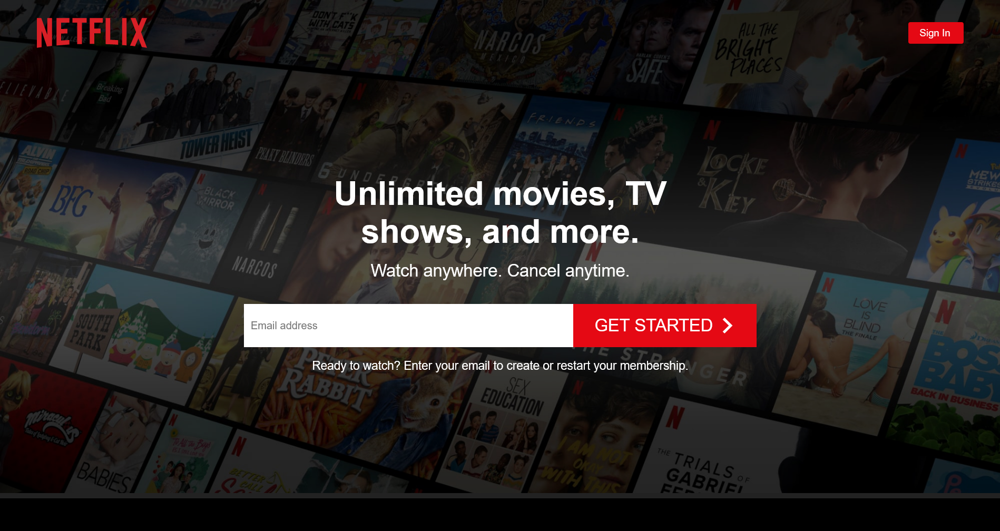
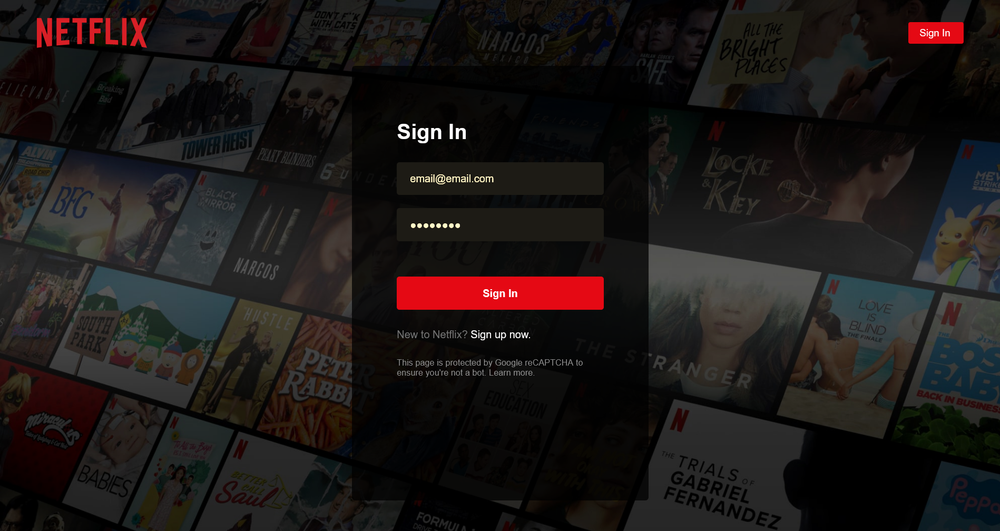
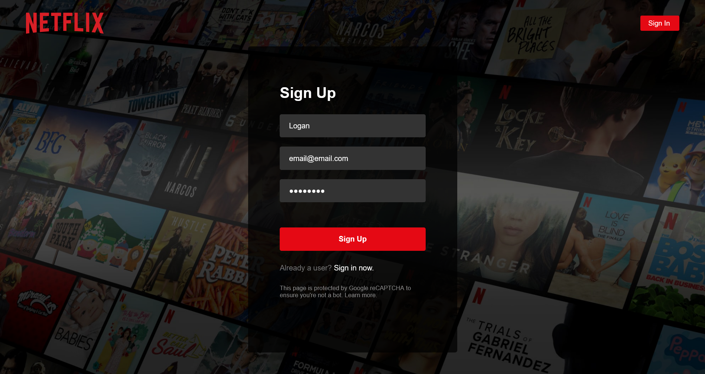
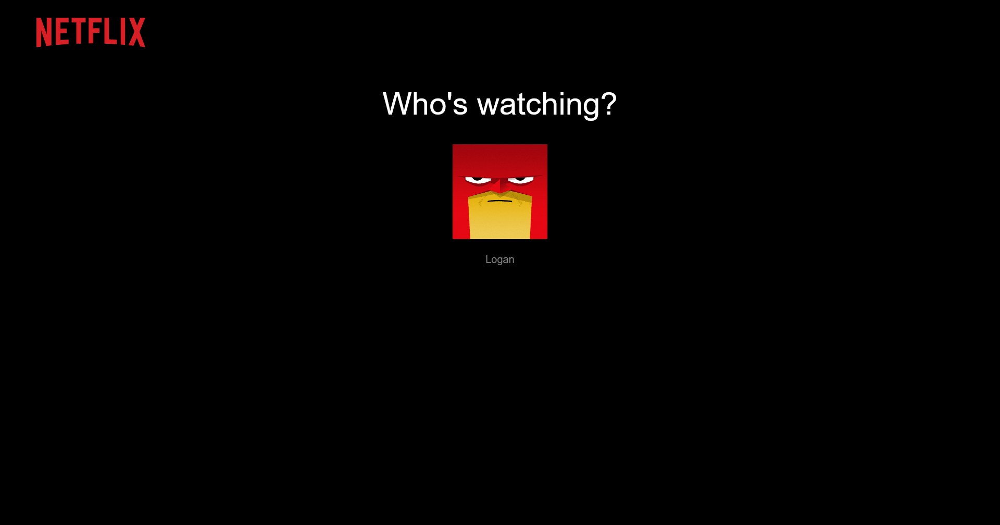
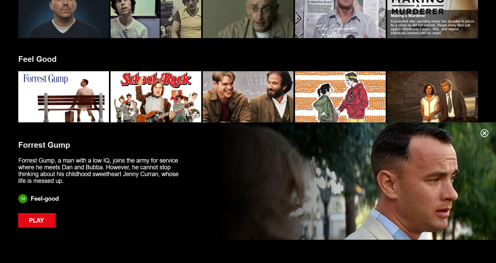
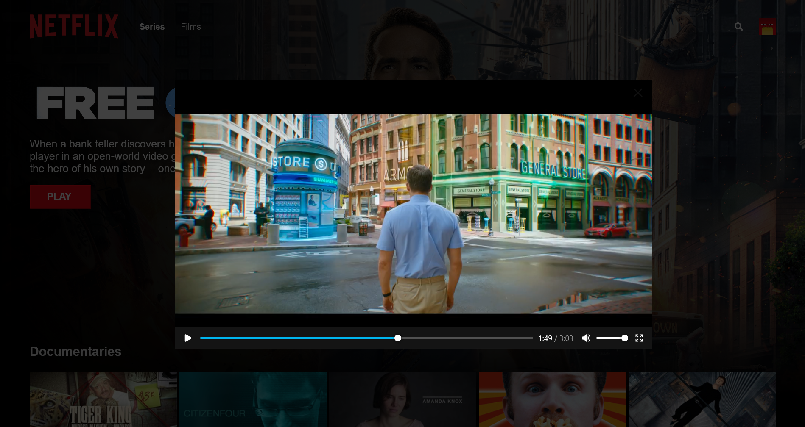
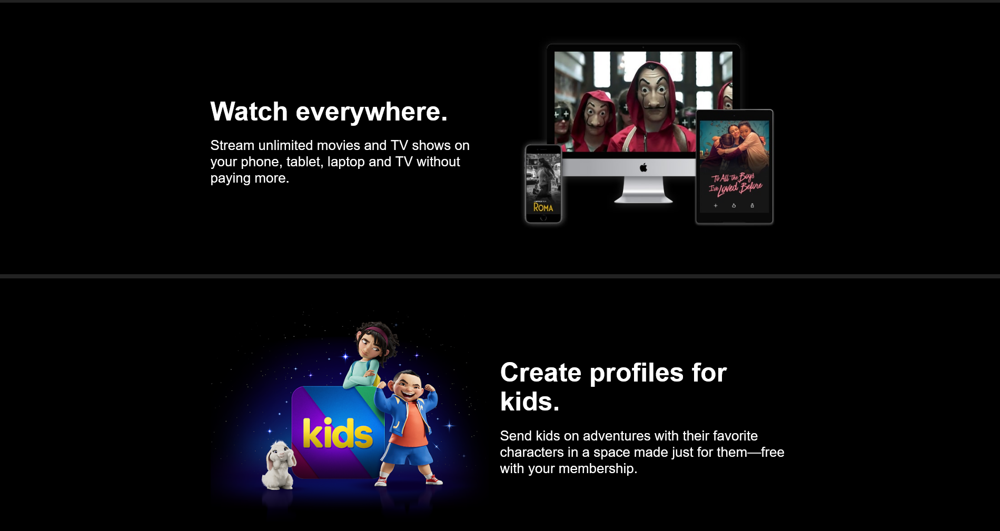

# Netflix Clone

## Announcements
- I received a request from Netflix itself to take down the clone (reasonably so), thus the hosted service is no longer avaiable to the public. 
- You can still follow the instructions below to host the website yourself though, or I can demo it in an interview 😉
  
## Features
- Home page, sign in, sign up, and browse pages
- User authentication and cloud storage with Firebase
- Search functionality with approximate string matching
- Compound components and styled-components

## Tech Stack
- React
- Firebase
- Styled-components
- Fuse.js

## Planned Additions
- Implement IMDb API to retrieve videos, images, and trailers
- Functionality for multiple users per account
- Social media login functionality

## Installation & Setup
1. Clone the repo:  
``$ git clone https://github.com/LoganWolfe/netflix-clone.git``

2. Navigate to the project directory and run the app:  
``npm start``

3. Open the app in the browser at the following link:  
``http://localhost:3000/``

## Preview
  
  
  
  
  
  
  
  
  
  
  
    
  
